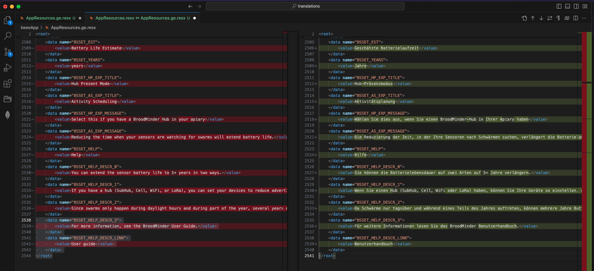

# translations
This is the public repo for translations. 
Three platforms are considered
- Mybroodminder.com
- The Bees App
- Beecounted.org

Any contributor can update existing translations or create translations to a new language. Simply follow the Pull request workflow to submit your translations.

You can also send us an email to [support&broodminder.com](mailto:support&broodminder.com)

Somme considerations to get you started :

- The master files are the english ones.

- The translation files are XML or json format. The translation only targets the `<value>` fields.

- You can use Visual Studio Code to manage your translations having side by side the English master and your translation. Simply follow this video [Compare files in VSC](https://youtu.be/50f5FBw9BSI)

- ChatGPT can be of great help translating large parts of that file. Simply copy paste (200 lines at once)

